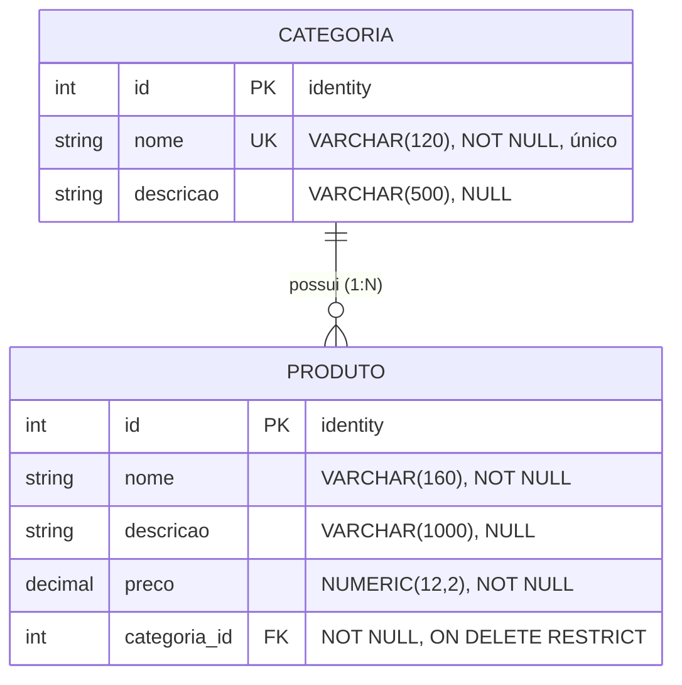

# Modelagem de Dados

## Diagrama Entidade-Relacionamento



## Tabelas

### `categorias`

| Coluna      | Tipo            | Constraints                       | Observação                                |
| ----------- | --------------- | --------------------------------- | ----------------------------------------- |
| `id`        | INTEGER         | PK, `GENERATED BY DEFAULT AS IDENTITY` | Chave primária                       |
| `nome`      | VARCHAR(120)    | NOT NULL, UNIQUE (`IX_categorias_nome`) | Validação backend: mínimo 5 caracteres |
| `descricao` | VARCHAR(500)    | NULL                              | Opcional                                   |

### `produtos`

| Coluna         | Tipo            | Constraints                                                   | Observação                                          |
| -------------- | --------------- | ------------------------------------------------------------- | --------------------------------------------------- |
| `id`           | INTEGER         | PK, `GENERATED BY DEFAULT AS IDENTITY`                        | Chave primária                                      |
| `nome`         | VARCHAR(160)    | NOT NULL                                                      | Validação backend: mínimo 5 caracteres              |
| `descricao`    | VARCHAR(1000)   | NULL                                                          | Opcional                                            |
| `preco`        | NUMERIC(12,2)   | NOT NULL, validação `> 0` no backend                          | Precisão monetária sem perda                        |
| `categoria_id` | INTEGER         | NOT NULL, FK → `categorias(id)` **ON DELETE RESTRICT**, index | Garante integridade referencial no nível do banco   |

## Decisões de Projeto

### Por que `ON DELETE RESTRICT`?
O desafio exige que tentativas de excluir categoria com produtos vinculados
retornem **HTTP 409 Conflict**. A verificação acontece no controller
(`AnyAsync` antes do `Remove`), e o `RESTRICT` no banco serve como **segunda
camada de defesa** — se algum cenário de concorrência burlar a checagem da
aplicação, o Postgres ainda recusa o `DELETE` lançando exceção que vira 500.

### Por que índice único em `categorias.nome`?
A regra de negócio do desafio não exige explicitamente, mas é a postura mais
defensiva: evita duplicação e dá UX melhor (mensagem clara de conflito em vez
de duas categorias com nome idêntico). Violações são detectadas no controller
através do `SqlState == "23505"` (unique violation do Postgres) e devolvidas
como 409.

### Por que `NUMERIC(12,2)` para preço?
Tipos `float`/`double` introduzem erros de ponto flutuante em valores
monetários (`0.1 + 0.2 != 0.3`). `NUMERIC(12,2)` permite até 999.999.999,99
sem perda de precisão.

### Por que snake_case nas colunas?
Padrão idiomático do Postgres. O mapeamento Fluent API converte os nomes das
propriedades C# (PascalCase) para snake_case no banco, mantendo cada lado com
sua convenção natural.

## Migration Gerada

O EF Core gera a migration `InitialCreate` que produz o seguinte SQL essencial
(simplificado para leitura):

```sql
CREATE TABLE categorias (
    id        INTEGER GENERATED BY DEFAULT AS IDENTITY PRIMARY KEY,
    nome      VARCHAR(120) NOT NULL,
    descricao VARCHAR(500) NULL
);
CREATE UNIQUE INDEX "IX_categorias_nome" ON categorias (nome);

CREATE TABLE produtos (
    id           INTEGER GENERATED BY DEFAULT AS IDENTITY PRIMARY KEY,
    nome         VARCHAR(160)   NOT NULL,
    descricao    VARCHAR(1000)  NULL,
    preco        NUMERIC(12,2)  NOT NULL,
    categoria_id INTEGER        NOT NULL,
    CONSTRAINT "FK_produtos_categorias_categoria_id"
        FOREIGN KEY (categoria_id) REFERENCES categorias (id)
        ON DELETE RESTRICT
);
CREATE INDEX "IX_produtos_categoria_id" ON produtos (categoria_id);
```
