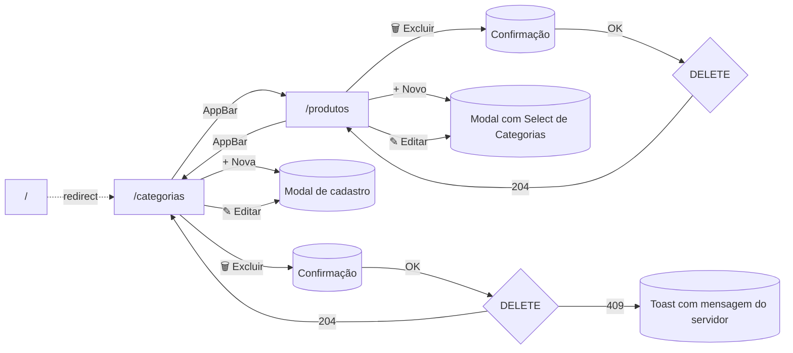

# Protótipo de Interface

Esboços de baixa fidelidade das telas implementadas. Wireframes em ASCII
servem como guia visual rápido; a implementação final em Vuetify segue
exatamente esta estrutura.

## Tela 1 — Listagem de Categorias (`/categorias`)

```
┌──────────────────────────────────────────────────────────────────────────┐
│ [icon] Inventário Comercial    [ Categorias ]  [ Produtos ]              │  ← AppBar
├──────────────────────────────────────────────────────────────────────────┤
│                                                                          │
│  Categorias                                          [ + Nova categoria ]│
│  Gerencie as categorias de produtos do catálogo.                         │
│                                                                          │
│  ┌────────────────────────────────────────────────────────────────────┐  │
│  │  ID │ Nome         │ Descrição                       │   Ações     │  │
│  ├─────┼──────────────┼─────────────────────────────────┼─────────────┤  │
│  │  1  │ Eletrônicos  │ Aparelhos e gadgets             │ [✎]  [🗑]   │  │
│  │  2  │ Ferramentas  │ Itens de manutenção             │ [✎]  [🗑]   │  │
│  │  3  │ Vestuário    │ —                               │ [✎]  [🗑]   │  │
│  └────────────────────────────────────────────────────────────────────┘  │
│                                          ⟨ 1 / 1 ⟩  10 por página ▾      │
└──────────────────────────────────────────────────────────────────────────┘
```

## Tela 2 — Modal de Cadastro / Edição de Categoria

```
                ┌──────────────────────────────────────────┐
                │ Editar categoria                         │
                │                                          │
                │  Nome *                                  │
                │  ┌────────────────────────────────────┐  │
                │  │ Eletrônicos                        │  │
                │  └────────────────────────────────────┘  │
                │  ↳ O Nome deve ter no mínimo 5 caracteres│  ← só aparece se inválido
                │                                          │
                │  Descrição                               │
                │  ┌────────────────────────────────────┐  │
                │  │ Aparelhos e gadgets eletrônicos    │  │
                │  │                                    │  │
                │  └────────────────────────────────────┘  │
                │                                          │
                │                  [ Cancelar ]  [ Salvar ]│  ← Salvar disabled se nome<5
                └──────────────────────────────────────────┘
```

## Tela 3 — Listagem de Produtos (`/produtos`)

```
┌──────────────────────────────────────────────────────────────────────────┐
│ [icon] Inventário Comercial    [ Categorias ]  [ Produtos ]              │
├──────────────────────────────────────────────────────────────────────────┤
│                                                                          │
│  Produtos                                              [ + Novo produto ]│
│  Gerencie os produtos do catálogo e seus vínculos com categorias.        │
│                                                                          │
│  ┌────────────────────────────────────────────────────────────────────┐  │
│  │ ID │ Nome           │ Categoria       │     Preço │     Ações      │  │
│  ├────┼────────────────┼─────────────────┼───────────┼────────────────┤  │
│  │ 1  │ Notebook Dell  │ ⦗Eletrônicos⦘   │ R$ 3.500,50 │ [✎]  [🗑]    │  │
│  │ 2  │ Chave de Fenda │ ⦗Ferramentas⦘   │    R$ 12,90 │ [✎]  [🗑]    │  │
│  └────────────────────────────────────────────────────────────────────┘  │
└──────────────────────────────────────────────────────────────────────────┘
```

## Tela 4 — Modal de Cadastro / Edição de Produto

```
                ┌──────────────────────────────────────────┐
                │ Novo produto                             │
                │                                          │
                │  Nome *                                  │
                │  ┌────────────────────────────────────┐  │
                │  │ Notebook Dell                      │  │
                │  └────────────────────────────────────┘  │
                │                                          │
                │  Descrição                               │
                │  ┌────────────────────────────────────┐  │
                │  │ Notebook Dell Inspiron 15          │  │
                │  └────────────────────────────────────┘  │
                │                                          │
                │  Preço (R$) *      Categoria *           │
                │  ┌──────────────┐  ┌────────────────┐    │
                │  │ 3500.50      │  │ Eletrônicos  ▾ │   ◀ Select alimentado por
                │  └──────────────┘  └────────────────┘    │   GET /api/categorias
                │                                          │
                │                  [ Cancelar ]  [ Salvar ]│
                └──────────────────────────────────────────┘
```

## Tela 5 — Diálogo de Confirmação de Exclusão

```
                ┌──────────────────────────────────────────┐
                │ ⚠ Excluir categoria                      │
                │                                          │
                │  Deseja realmente excluir a categoria    │
                │  "Eletrônicos"? Esta ação não pode ser   │
                │  desfeita.                               │
                │                                          │
                │                 [ Cancelar ]  [ EXCLUIR ]│
                └──────────────────────────────────────────┘
```

## Tela 6 — Toast de Erro (regra de integridade referencial)

Quando o usuário tenta excluir uma categoria que possui produtos vinculados,
a API responde **409 Conflict** com a mensagem exata exigida pelo desafio.
O frontend captura e exibe:

```
                                            ┌─────────────────────────────────────────────┐
                                            │ ⊗  Não é possível excluir uma categoria     │
                                            │     que possua produtos vinculados.    [×]  │
                                            └─────────────────────────────────────────────┘
                                                                       (canto inferior direito)
```

## Fluxo de Navegação



## Componentes Vuetify Utilizados

| Componente            | Onde aparece                                      |
| --------------------- | ------------------------------------------------- |
| `v-app-bar`           | Barra de navegação topo                           |
| `v-data-table`        | Grid de listagem (categorias e produtos)          |
| `v-dialog`            | Modal de cadastro/edição e de confirmação         |
| `v-form` + `v-text-field` / `v-textarea` | Campos do formulário              |
| `v-select`            | Seleção de Categoria no formulário de Produto     |
| `v-snackbar`          | Toast de sucesso e de erro                        |
| `v-chip`              | Badge da categoria na coluna da listagem          |
| `v-btn`               | Botões de ação (Editar / Excluir / Salvar)        |
